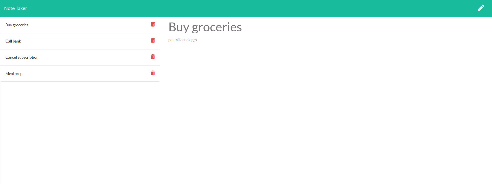

# Project Title: Note Taker 

## Project Description
This project is built using **Node & Express.js and is deployed to Heroku**. The aim of this project was modify starter code to create an application called Note Taker that can be used to write and save notes. 

The application’s front end had already been created. The goal was to build the back end, connect the two, and then deploy the entire application to Heroku.

## Screenshot

## Licensing 
The licensing used for this project is MIT

## Contributions 
Author: Rachael McIlhagga
Twitter: @breadlikerach

    
## Questions
* If you have any questions about this project, please reach out to me  through <a href="https://github.com/mcilhaggis">Github</a>  or via <a href="mailto:rachael.mcilhagga@live.co.uk">Email</a>